# 🤖 AI-Powered Product Buying Decision Framework (India – 2025)

Welcome to the complete project repository for **AI-Powered Buying Decisions for Personal Tech Products in India (Q2/Q3 2025)**.

This project demonstrates how **Prompt Engineering + LLMs (ChatGPT & Google Gemini)** can automate the end-to-end product selection process from researching market trends to recommending tailored buying options for professionals, students, and enthusiasts.

---

## 📌 Project Overview

In today’s tech-driven world, making a confident, value-for-money purchase can be overwhelming due to the abundance of options, marketing hype, and scattered reviews.

So, I turned this challenge into a structured **AI project**.

### 🚀 The Goal:
To build a **prompt-based framework** that helps any consumer:
- Discover trending personal tech products in India
- Compare and evaluate product features, pricing, pros & cons
- Generate a decision matrix
- Produce a tailored buyer’s guide

---

## 🧭 How the Project Works (Storytelling)

The journey began with a simple real-world challenge:  
**"How can I make the smartest buying decision using AI?"**

Each step involved writing a carefully crafted prompt, processing it through an LLM (ChatGPT or Gemini), and capturing the resulting output. The outputs were structured, insightful, and ready for presentation.

---

## 🔢 Prompt Steps and Corresponding Outputs

| Step | Prompt Description | AI Output | Link |
|------|---------------------|-----------|------|
| **Step 1** | Base Prompt to define objective and structure for the buying guide | Output 1: Prompt Playbook | [View Output 1](https://github.com/SachinSavkare/AI-Powered-Product-Buying-Decision-Framework-India-2025-/blob/main/OUTPUT%201.pdf) |
| **Step 2** | Master Prompt to generate full Product Buying Playbook | Output 2: Complete Playbook | [View Output 2](https://github.com/SachinSavkare/AI-Powered-Product-Buying-Decision-Framework-India-2025-/blob/main/OUTPUT%202.pdf) |
| **Step 3** | Gemini Prompt to create 2–3 page product comparison | Output 3: Comparison Doc | [View Output 3](https://github.com/SachinSavkare/AI-Powered-Product-Buying-Decision-Framework-India-2025-/blob/main/OUTPUT%203.pdf) |
| **Step 4** | Master Prompt + attachments to refine comparison | Output 4: Refined Comparison | [View Output 4](https://github.com/SachinSavkare/AI-Powered-Product-Buying-Decision-Framework-India-2025-/blob/main/OUTPUT%204.pdf) |
| **Step 5** | Prompt to create decision matrix comparing products on 4 criteria | Output 5: Product Decision Matrix | [Download Excel](https://github.com/SachinSavkare/AI-Powered-Product-Buying-Decision-Framework-India-2025-/blob/main/Product%20Decision%20Matrix.xlsx) |
| **Step 6** | Base Prompt to create buyer’s guide (no attachment) | Output 6: Buyer Guide (Raw) | [View Output 6](https://github.com/SachinSavkare/AI-Powered-Product-Buying-Decision-Framework-India-2025-/blob/main/OUTPUT%206.pdf) |
| **Step 7** | Master Prompt + attachments for final structured buyer’s guide | Output 7: Final Buyer’s Guide | [View Output 7](https://github.com/SachinSavkare/AI-Powered-Product-Buying-Decision-Framework-India-2025-/blob/main/OUTPUT%207%20(Buyers%20Guide).pdf) |


---

## 🧾 Sample Prompts (All 7 Steps)

This project demonstrates how thoughtful **prompt design and chaining** can transform a simple requirement into a fully functional decision system without writing a single line of code.

📎 [Prompt](https://github.com/SachinSavkare/AI-Powered-Product-Buying-Decision-Framework-India-2025-/blob/main/Prompt%20Steps.pdf)

---

### 🔹 Step 1: Base Prompt – Define Playbook Objective & Structure

**Prompt:**

*"I want to buy a Personal Product for myself in India in 2025. You are a prompt master who specializes in writing prompts for LLMs. Write a prompt that I can feed to any LLM model to create a detailed playbook that anyone can use to make a product buying decision. List the objective, deliverable requirements, and structure of the playbook..."*

📎 [Output 1](https://github.com/SachinSavkare/AI-Powered-Product-Buying-Decision-Framework-India-2025-/blob/main/OUTPUT%201.pdf)

---

### 🔹 Step 2: Master Prompt – Generate Full Product Buying Playbook

**Prompt:**

*"You are a prompt engineer. Create a prompt that will help generate a detailed product buying playbook using trending personal tech products in India. The playbook should include: objective, deliverables, product list, trend analysis, feature comparison, expert blogs, pros & cons, and user-based recommendations."*

📎 [Output 2](https://github.com/SachinSavkare/AI-Powered-Product-Buying-Decision-Framework-India-2025-/blob/main/OUTPUT%202.pdf)

---

### 🔹 Step 3: Prompt – Create 2–3 Page Product Comparison Document

**Prompt:**

*"Now create a new prompt that uses the output of the playbook to generate a 2–3 page product comparison for 3 shortlisted products. Ensure it compares on performance, pricing, usability, and list pros & cons in clear sections."*

📎 [Output 3](https://github.com/SachinSavkare/AI-Powered-Product-Buying-Decision-Framework-India-2025-/blob/main/OUTPUT%203.pdf)

---

### 🔹 Step 4: Prompt with Attachments – Refine Comparison Output

**Prompt:**

*"Use the Master Prompt from Step 2 along with the attachment of Output 3 to regenerate the comparison document with refined formatting, better clarity, and improved reasoning for product differentiation."*

📎 [Output 4](https://github.com/SachinSavkare/AI-Powered-Product-Buying-Decision-Framework-India-2025-/blob/main/OUTPUT%204.pdf)

---

### 🔹 Step 5: Prompt – Generate Product Decision Matrix

**Prompt:**

*"Write a prompt that takes the top 3 products and compares them using a decision matrix. The criteria should include: Price, Performance, Usability, and Value for Money. Each product should be scored, and a final recommendation provided."*

📎 [Product Decision Matrix (Excel)](https://github.com/SachinSavkare/AI-Powered-Product-Buying-Decision-Framework-India-2025-/blob/main/Product%20Decision%20Matrix.xlsx)

---

### 🔹 Step 6: Prompt – Buyer’s Guide Without Attachments

**Prompt:**

*"Now, write a prompt that will generate a buyer's guide for 3 user segments: Professionals, Students, and Enthusiasts — using only the Playbook (Output 2) and Comparison (Output 4), without attachments. The guide should recommend one product for each user type with reasoning."*

📎 [Output 6](https://github.com/SachinSavkare/AI-Powered-Product-Buying-Decision-Framework-India-2025-/blob/main/OUTPUT%206.pdf)

---

### 🔹 Step 7: Master Prompt + All Outputs – Final Buyer’s Guide

**Prompt:**

*"Use the master prompt again, but this time include all attachments (Playbook, Comparison Document, Decision Matrix). Generate a final structured buyer’s guide for Indian customers with sections: Product Summary, Comparison Table, Recommendation by User Type, and Final Verdict."*

📎 [Output 7](https://github.com/SachinSavkare/AI-Powered-Product-Buying-Decision-Framework-India-2025-/blob/main/OUTPUT%207%20(Buyers%20Guide).pdf)

---

## 📊 Project Architecture

```mermaid
graph TD
    A[Requirement Received] --> B[Create Base Prompt]
    B --> C[Generate Full Buying Playbook]
    C --> D[Use Playbook to Compare Products]
    D --> E[Build Decision Matrix]
    E --> F[Generate Buyer’s Guide]
    F --> G[Final Buyer’s Guide with Segmentation]
```



---

## 📘 Final Presentation Deck

Want to see how this was pitched to stakeholders?  
📊 [Download the Full Presentation (PDF)](https://github.com/SachinSavkare/AI-Powered-Product-Buying-Decision-Framework-India-2025-/blob/main/Presentation.pdf)

---

## 📈 Deliverables Summary

| Deliverable | Description |
|-------------|-------------|
| **Buying Playbook** | 10 trending tech products, detailed feature analysis, expert reviews |
| **Comparison Doc** | Side-by-side 3-product feature and price comparison |
| **Decision Matrix** | Compared based on Price, Performance, Usability, Value |
| **Buyer’s Guide** | Tailored to Professionals, Students, Enthusiasts |

---

## 👥 Target Stakeholders

- **Product Strategists** – Use for consumer market analysis  
- **Marketing Teams** – Position products for segment fit  
- **AI Builders** – Learn prompt chaining techniques  
- **Buyers** – Want an objective buying system? Start here

---

## 🌐 Repository Structure

```bash
├── outputs/
│   ├── OUTPUT 1.docx
│   ├── OUTPUT 2.docx
│   ├── OUTPUT 3.docx
│   ├── OUTPUT 4.docx
│   ├── OUTPUT 6.docx
│   ├── OUTPUT 7 (Buyers Guide).docx
│   ├── Product Decision Matrix.xlsx
│   └── Presentation.pdf
├── README.md
```

---

## 🔗 Want to Learn or Reuse?

You can:
- Fork this repo and reuse the prompt templates  
- Swap product categories and re-run it for other industries  
- Integrate into your own consumer tool or chatbot  

---

## 💬 Final Thoughts

This project proves that with structured thinking, prompt engineering, and the right AI tools, we can build intelligent systems that solve real-world problems  **without code**.

---
